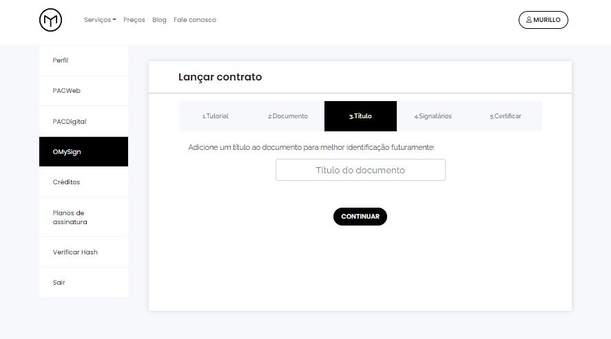
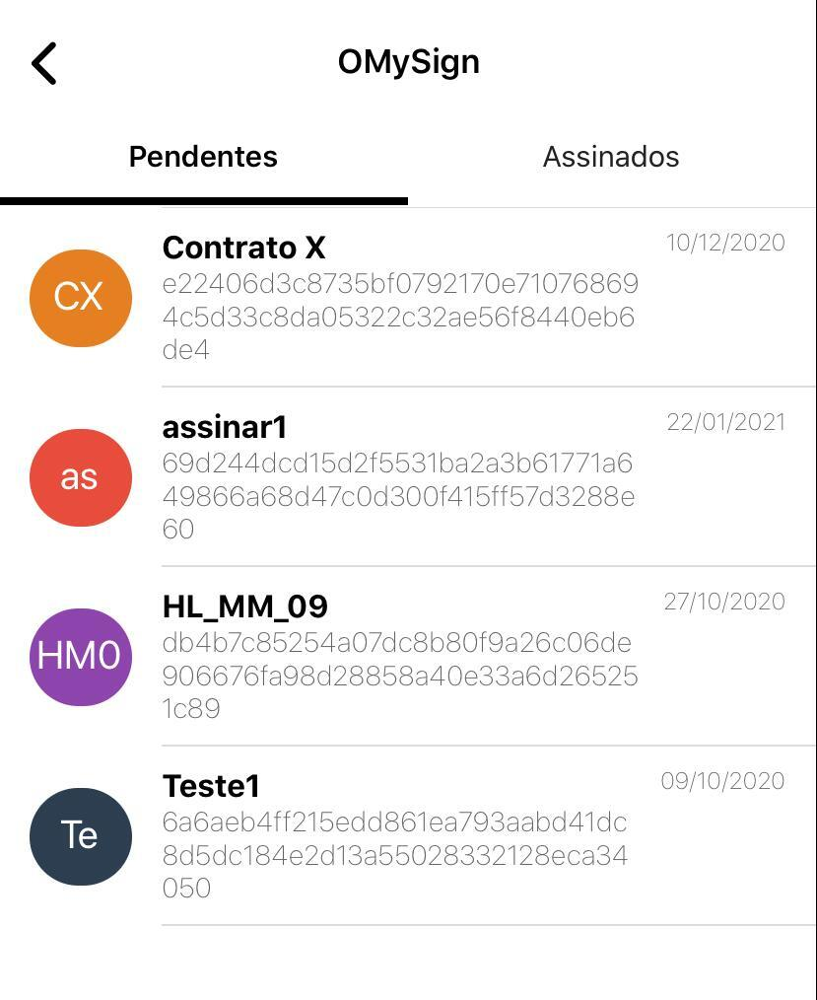
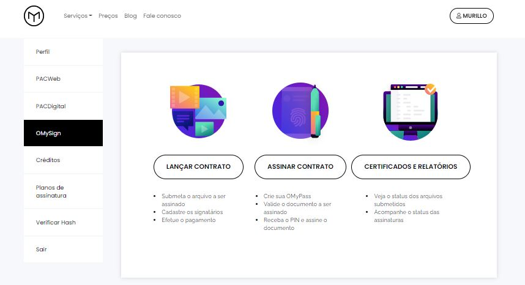
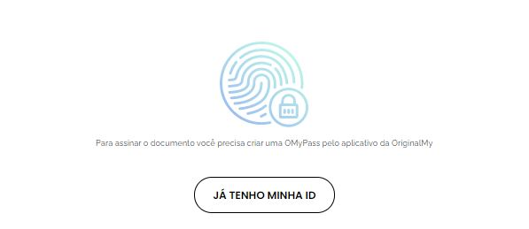
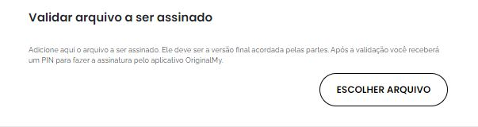

OMySign - Assinatura digital de contratos 
=================================

Leia as recomendações para **reforçar a validade jurídica** do seu contrato neste link:                         http://originalmy.readthedocs.io/pt_BR/latest/80-recomendacoes.html

=========================
Certificação de Contratos
=========================

1. Entre em https://originalmy.com e faça Login.

2. Acesse a aba **Serviços**, selecione o serviço **OMySign** e clique em **Comece aqui**.

3. Submeta a versão final do contrato a ser assinado (PDF).

.. image:: images/omysign3.JPG
  :scale: 70%

4. Coloque um título para identificar o contrato (este apelido é como o documento aparecerá no app).

5. Preencha os CPFs ou Passaportes dos signatários.

  
6.  Clique em **continuar** para concluir a certificação do contrato e efetue o pagamento via cartão de crédito/voucher.

.. warning:: O documento somente será certificado em Blockchain e aparecerá no app para assinatura após todos os signatários instalarem o app e completarem o cadastro.

=======================
Assinatura de contratos
=======================

Como assinar com o documento
---------------------------------

1. Baixe o app **OriginalMy** para Android ou iOS, nas lojas de aplicativo de cada aparelho. 

2. Efetue o cadastro completo, valide seu email e aguarde a validação do cadastro. 

3. Entre no Menu e clique em **OMySign**.

4. Na lista de **Pendentes**, clique no documento que deseja assinar.

5. Comprove a posse sobre o documento a ser assinado selecionando a opção **Abrir contrato**.

 
6. Selecione o arquivo na sua biblioteca de documentos e conclua clicando em **Assinar**.
 
.. image:: images/assinatura5.jpg
 :scale: 40%
 
7. Documento assinado com sucesso!
  

 
 

Como assinar com o PIN
---------------------------------

O PIN é necessário para a **PROVA DE POSSE** do documento.

1. Entre em https://originalmy.com, efetue o seu **Login**

2. Na área logada, selecione a opção OMySign na coluna lateral esquerda, e em seguida clique em **Assinar contrato**.

 
 3. Seleciona a opção **Já tenho minha ID** se este for o seu caso (Se ainda não tiver criado sua OMyPass, basta baixar o aplicativo e criá-la).
 

 
 4. Escolha o arquivo a ser assinado e anote o PIN.
 

 
  

    
Controles de Segurança para a Assinatura de Contratos
-----------------------------------------------------

O OriginalMy possui 4 níveis de segurança para a assinatura de contratos:

1) Cadastro completo através do app (KYC completo com validação do CPF ou passaporte em bases públicas)

2) Usuário e senha

3) Chave privada em posse do usuário (através da um conjunto com 12 palavras em português ou inglês dependendo do idioma selecionado)

4) Prova de Posse do documento (através do PIN)

.. note:: KYC significa Know Your Customer, ou Conheça Seu Cliente em português. São técnicas para identificar o usuário quando o uso da ferramenta é crítico e precisa ser aderente às regulações vigentes.

Exemplo de conjunto de palavas. **Anote-as em um papel**. Sua identidade blockchain somente poderá ser recuperada com as doze palavras na mesma ordem apresentada, por este motivo é fundamental que elas sejam armazenadas em local seguro.

.. note:: O OriginalMy **nunca** entrará em contato para solicitar as 12 palavras fornecidas no cadastro
  Lembre-se que essas 12 palavras restauram a sua Identidade Blockchain.
  Anote-as em um papel e guarde-as em local seguro.
  
.. note:: Para assinar documentos através do browser, será necessário entrar com as 12 palavras fornecidas no cadastro.
  Depois disso o sistema fornecerá uma opção para baixar um arquivo que facilitará o processo nas próximas vezes. Armazene este arquivo em um local seguro.

.. warning:: **NUNCA** entregue as 12 palavras ou o arquivo baixado para qualquer pessoa. Eles representam a sua identidade blockchain.

