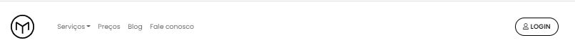
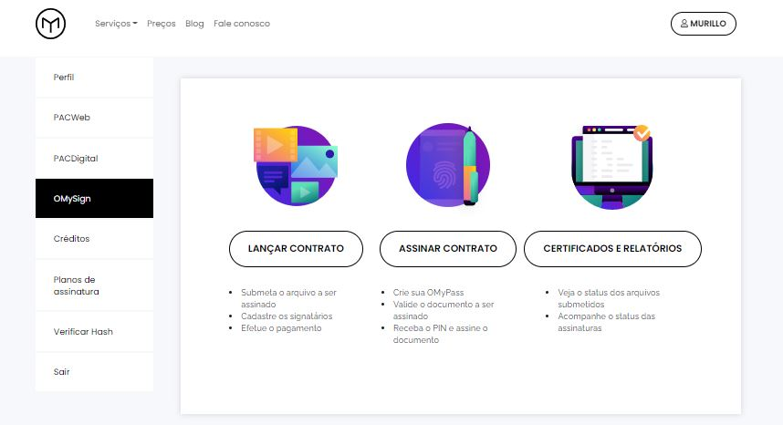
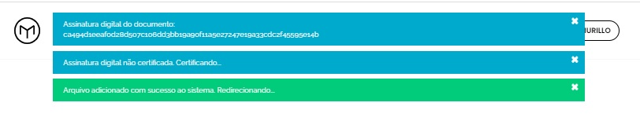
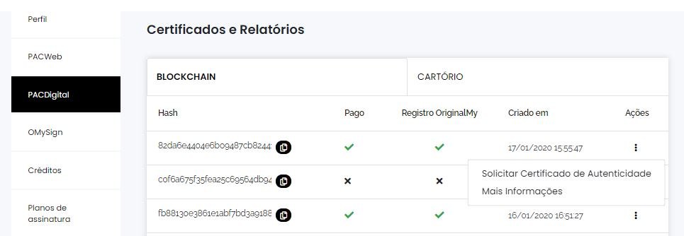

PACDigital - Certificação de documentos digitais 
=======================================

=================
Certificação unitária
=================

Este documento foi elaborado para guiar o usuário passo a passo para certificar a existência e anterioridade de documentos digitais utilizando a plataforma da OriginalMy, sejam eles arquivos de texto, imagem ou som.

.. warning:: O arquivo que será certificado, não poderá sofrer alterações posteriores, sendo assim, crie cópias de segurança do arquivo e guarde em locais seguros. Mesmo um salvamento automático do arquivo é considerado como alteração.

.. note:: **Para sua segurança e privacidade, o documento não é armazenado pela OriginalMy**

Criando uma PACDigital 
---------------------

- Acesse o site: https://originalmy.com/ e clique em **Login**
  

 

- Na coluna esquerda, selecione a opção **PACDigital** e escolha entre as opções: **Certificação Blockchain** ou **Certificação Cartório**, em seguida clique em **Selecionar arquivo** 

- Assim que o arquivo é submetido na plataforma, é gerada a assinatura digital pro documento (chamada **Hash**) e ele estará pronto para ser enviado para certificação em Blockchain após o pagamento

- Conclua o pagamento com cartão de crédito ou inserindo um cupom de crédito. Assim que o pagamento for confirmado, o documento será enviado para certificação no Blockchain.

.. image:: images/pacdigital2.jpg 

- Assim que o documento for certificado em Blockchain, você terá acesso ao **Certificado de Autenticidade** disponível na coluna **Ações**. Este documento fornecerá os dados da transação e o carimbo de tempo do documento

Verificando sua PACDigital
-------------------------

Para efetuar a consulta, é necessário ter a posse do documento que foi certificado. A consulta de qualquer documento na plataforma pode ser realizada de forma gratuita, quantas vezes desejar e em qualquer momento.

- Acesse o site: originalmy.com, desça até a parte inferior do site e clique em **Verificar autenticidade**
  
.. image:: images/pacdigital.jpg  
  

- Clique para selecionar o arquivo previamente certificado. Submetendo o documento à plataforma, todas as informações relativas ao registro aparecerão na tela.

Assim que o arquivo é submetido à plataforma, a assinatura digital (**Hash**) é recalculada e caso o documento não tenha sofrido nenhuma alteração, é apresentado o status atual do documento: 

- Aguardando pagamento. (Quando a assinatura digital não é encontrada)
- Certificado em Blockchain. (Quando a assinatura digital é encontrada)

